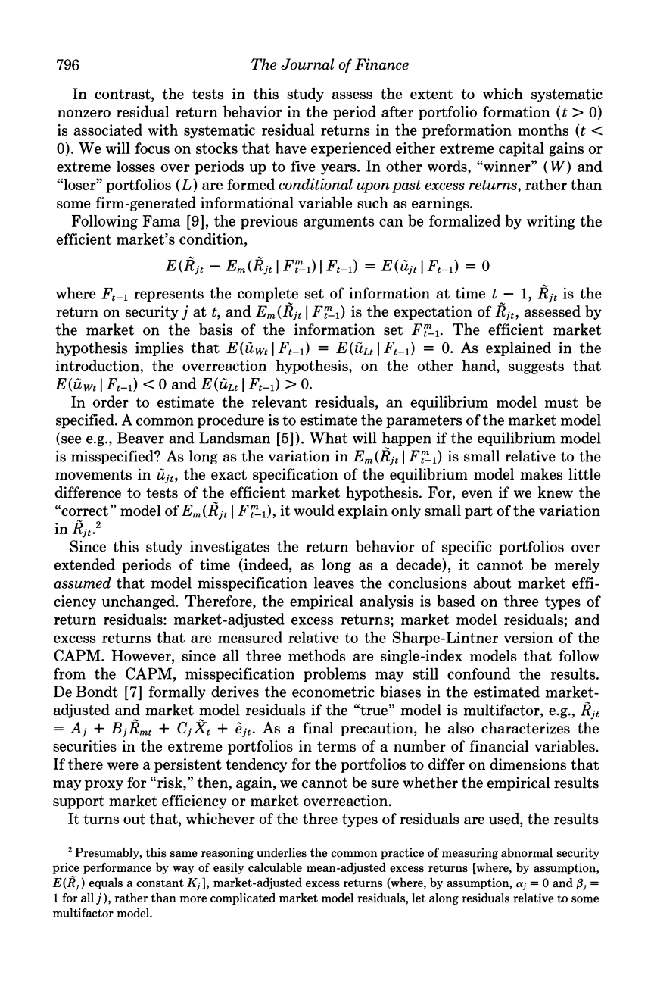
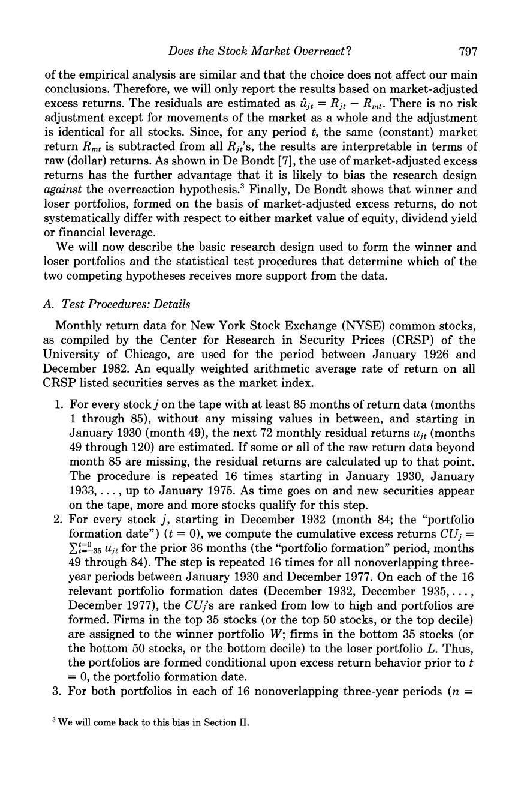
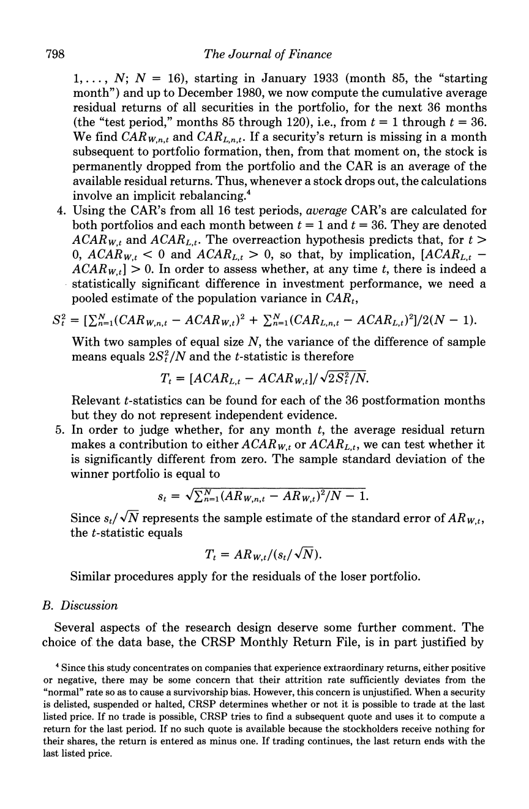
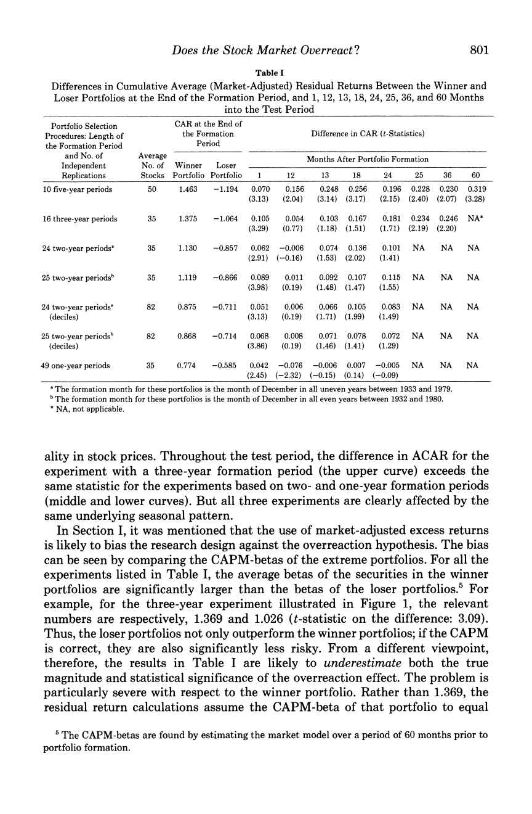

# debondt-thaler-does-the-stock-market-overreact

A complete run of the `kip` ingestion pipeline over `debondt thaler 1985 overreact`.

**68 knowledge units** · **182 citations** (182 verified) · **23 entries handed off** · run `dt` · schema `3.1.0`

---

## Reading this folder

**If you are a person:** the [entries](#the-knowledge-handed-off) below are the output — what a knowledge base would receive. The [assets](#assets) are the tables, formulas and page images recovered from the source, shown as they are stored.

**If you are a model asked to ingest this run, do not work from this file.** It is a rendering and it is lossy. Read, in order:

1. [`runs/dt/07_enqueue/enqueue.jsonl`](runs/dt/07_enqueue/enqueue.jsonl) — **the handoff.** One JSON event per approved entry, each with `payload.title`, `payload.assertions`, `payload.knowledge_state` and an `idempotency_key`. This is the only file you need in order to ingest; everything below is for checking what it says.
2. [`runs/dt/02_units/units.jsonl`](runs/dt/02_units/units.jsonl) — the evidence. Each unit carries verbatim excerpts with character offsets into `normalized.txt`, and `asset_ref` where the evidence is a table cell or a formula. Follow `payload.source_unit_ids` from an entry to get here.
3. `01_normalized/<source>/assets.jsonl` — the tables, formulas and figures. **Check `fidelity` before you trust a comparison:** `exact` came from the source's own markup and can be compared as a string; `transcribed` was read off an image and must not be.
4. `01_normalized/<source>/normalized.txt` — the flat text every non-asset citation resolves against, by character offset.
5. [`runs/dt/00_original_sources/`](runs/dt/00_original_sources) — the raw source, unmodified. Go here when you need to check the pipeline itself.

Everything else records how the output was arrived at: the routing, the judgments, the candidates before audit, and the audit findings.

## What is in each folder

| folder | contents |
|---|---|
| [`00_original_sources`](runs/dt/00_original_sources) | The source documents exactly as ingested, byte for byte. |
| [`01_normalized`](runs/dt/01_normalized) | One directory per source: `normalized.txt` (the flat text every citation resolves against), `assets.jsonl` (tables, formulas and figures the flat text could not hold), `manifest.json`, and `assets/` for any rendered page images. |
| [`02_units`](runs/dt/02_units) | `units.jsonl` — every extracted knowledge unit with its verbatim evidence and character offsets. `omissions.jsonl` — what the completeness check found missing. `rejects.jsonl` if any record failed materialization. |
| [`03_clusters`](runs/dt/03_clusters) | Which units were routed together for comparison, and why. |
| [`04_assessments`](runs/dt/04_assessments) | One judgment per claim: does the evidence support it, contradict it, or settle nothing, and how many INDEPENDENT sources it rests on. |
| [`05_candidates`](runs/dt/05_candidates) | Proposed knowledge-base entries, before audit. |
| [`06_audit`](runs/dt/06_audit) | `audits.jsonl` — the adversarial review of each candidate, with deterministic check results. `corpus_coverage.json` — whether the output fairly represents the whole corpus. |
| [`07_enqueue`](runs/dt/07_enqueue) | **`enqueue.jsonl` is the handoff.** One idempotent event per approved entry. This is the file a consuming knowledge base reads. |
| [`_handoff`](runs/dt/_handoff) | The complete record of every model call: `pending.jsonl` holds the requests, `responses.jsonl` the answers. Copying `responses.jsonl` into a fresh workspace replays the entire run from cache. |

## Does the output represent the corpus?

The run's own corpus-coverage audit returned **`represented`**.

> Every formula here is `transcribed`, not `exact` -- read off a rendered page because the 1985 scan's text layer destroyed the mathematics. The audit labelled the affected leaves. This is the opposite provenance from a document that carries MathML, and the two must not be compared by string equality.

> Not loss: the detector renders a page only where the text layer shows damage. Pages 3, 4 and 8 contain notation (`P/E`, `t = 0`, `(t > 0)`) that extracted cleanly and were correctly not rendered -- nothing there to recover. Confirmed by reading all 14 page images independently.

> The page renders are kept as assets, so every transcription can be checked against the image it was read from. For a transcription that is the only check that works.

Full judgment: [`06_audit/corpus_coverage.json`](runs/dt/06_audit/corpus_coverage.json).

## What the checks found

- The completeness check reported **3 finding(s)** against the first extraction: [`02_units/omissions.jsonl`](runs/dt/02_units/omissions.jsonl).
- The adversarial audit reviewed **23 candidate(s)** and passed 23 without requiring a correction: [`06_audit/audits.jsonl`](runs/dt/06_audit/audits.jsonl).

## Assets

**18 assets** — 4 figure, 13 formula, 1 table. 13 cited by at least one unit, 5 not cited.

An uncited asset is not a failure. A source carries structure that is not content -- a navigation box marked up as a table, a page rendered to check one equation on it -- and capturing it losslessly while citing nothing from it is the correct outcome.

Fidelity is part of the record, because the kinds are not equally trustworthy:

- **transcribed** (18) — a model or geometry read it — a READING, not a quote; compare by meaning, not by string

Evidence cites an asset with `asset_ref {asset_id, row, col}` for a table cell, or `{asset_id}` for a formula. A cell reference resolves to the value **and** the headers governing it, which is what makes a figure checkable rather than merely quoted.

### `src-debondt-thaler-1985-overreact-d07fdf64`

[`normalized.txt`](runs/dt/01_normalized/src-debondt-thaler-1985-overreact-d07fdf64/normalized.txt) · [`assets.jsonl`](runs/dt/01_normalized/src-debondt-thaler-1985-overreact-d07fdf64/assets.jsonl) · [`manifest.json`](runs/dt/01_normalized/src-debondt-thaler-1985-overreact-d07fdf64/manifest.json)

#### `fig-src-debondt-thaler-1985-overreact-d07fdf64-0001`

figure · **transcribed** · extractor `pdf_render_v1` · page 5 · not cited by any unit



#### `fig-src-debondt-thaler-1985-overreact-d07fdf64-0002`

figure · **transcribed** · extractor `pdf_render_v1` · page 6 · not cited by any unit



#### `fig-src-debondt-thaler-1985-overreact-d07fdf64-0003`

figure · **transcribed** · extractor `pdf_render_v1` · page 7 · not cited by any unit



#### `fig-src-debondt-thaler-1985-overreact-d07fdf64-0004`

figure · **transcribed** · extractor `pdf_render_v1` · page 10 · not cited by any unit



#### `fml-src-debondt-thaler-1985-overreact-d07fdf64-0005`

formula · **transcribed** · extractor `visual_read_v1` · page 5 · cited by 2 units

$$E(\tilde{R}_{jt} - E_m(\tilde{R}_{jt} \mid F^m_{t-1}) \mid F_{t-1}) = E(\tilde{u}_{jt} \mid F_{t-1}) = 0$$

```latex
E(\tilde{R}_{jt} - E_m(\tilde{R}_{jt} \mid F^m_{t-1}) \mid F_{t-1}) = E(\tilde{u}_{jt} \mid F_{t-1}) = 0
```

> Following Fama [9], the previous arguments can be formalized by writing the efficient market's condition,

Cited by: `u-src-debondt-thaler-1985-overreact-d07fdf64-0018`, `u-src-debondt-thaler-1985-overreact-d07fdf64-0059`

#### `fml-src-debondt-thaler-1985-overreact-d07fdf64-0006`

formula · **transcribed** · extractor `visual_read_v1` · page 5 · cited by 2 units

$$E(\tilde{u}_{Wt} \mid F_{t-1}) = E(\tilde{u}_{Lt} \mid F_{t-1}) = 0$$

```latex
E(\tilde{u}_{Wt} \mid F_{t-1}) = E(\tilde{u}_{Lt} \mid F_{t-1}) = 0
```

> The efficient market hypothesis implies that

Cited by: `u-src-debondt-thaler-1985-overreact-d07fdf64-0018`, `u-src-debondt-thaler-1985-overreact-d07fdf64-0060`

#### `fml-src-debondt-thaler-1985-overreact-d07fdf64-0007`

formula · **transcribed** · extractor `visual_read_v1` · page 5 · cited by 2 units

$$E(\tilde{u}_{Wt} \mid F_{t-1}) < 0 \quad\text{and}\quad E(\tilde{u}_{Lt} \mid F_{t-1}) > 0$$

```latex
E(\tilde{u}_{Wt} \mid F_{t-1}) < 0 \quad\text{and}\quad E(\tilde{u}_{Lt} \mid F_{t-1}) > 0
```

> As explained in the introduction, the overreaction hypothesis, on the other hand, suggests that

Cited by: `u-src-debondt-thaler-1985-overreact-d07fdf64-0018`, `u-src-debondt-thaler-1985-overreact-d07fdf64-0060`

#### `fml-src-debondt-thaler-1985-overreact-d07fdf64-0008`

formula · **transcribed** · extractor `visual_read_v1` · page 5 · cited by 1 unit

$$\tilde{R}_{jt} = A_j + B_j \tilde{R}_{mt} + C_j \tilde{X}_t + \tilde{e}_{jt}$$

```latex
\tilde{R}_{jt} = A_j + B_j \tilde{R}_{mt} + C_j \tilde{X}_t + \tilde{e}_{jt}
```

> De Bondt [7] formally derives the econometric biases in the estimated market-adjusted and market model residuals if the "true" model is multifactor, e.g.,

Cited by: `u-src-debondt-thaler-1985-overreact-d07fdf64-0063`

#### `fml-src-debondt-thaler-1985-overreact-d07fdf64-0009`

formula · **transcribed** · extractor `visual_read_v1` · page 5 · cited by 1 unit

$$E(\tilde{R}_j) = K_j$$

```latex
E(\tilde{R}_j) = K_j
```

> Footnote 2: measuring abnormal security price performance by way of easily calculable mean-adjusted excess returns [where, by assumption, E(R_j) equals a constant K_j]

Cited by: `u-src-debondt-thaler-1985-overreact-d07fdf64-0064`

#### `fml-src-debondt-thaler-1985-overreact-d07fdf64-0010`

formula · **transcribed** · extractor `visual_read_v1` · page 5 · cited by 1 unit

$$\alpha_j = 0 \quad\text{and}\quad \beta_j = 1 \ \text{for all } j$$

```latex
\alpha_j = 0 \quad\text{and}\quad \beta_j = 1 \ \text{for all } j
```

> Footnote 2: market-adjusted excess returns (where, by assumption, alpha_j = 0 and beta_j = 1 for all j)

Cited by: `u-src-debondt-thaler-1985-overreact-d07fdf64-0064`

#### `fml-src-debondt-thaler-1985-overreact-d07fdf64-0011`

formula · **transcribed** · extractor `visual_read_v1` · page 6 · cited by 2 units

$$\hat{u}_{jt} = R_{jt} - R_{mt}$$

```latex
\hat{u}_{jt} = R_{jt} - R_{mt}
```

> Therefore, we will only report the results based on market-adjusted excess returns. The residuals are estimated as

Cited by: `u-src-debondt-thaler-1985-overreact-d07fdf64-0022`, `u-src-debondt-thaler-1985-overreact-d07fdf64-0061`

#### `fml-src-debondt-thaler-1985-overreact-d07fdf64-0012`

formula · **transcribed** · extractor `visual_read_v1` · page 6 · cited by 2 units

$$CU_j = \sum_{t=-35}^{t=0} u_{jt}$$

```latex
CU_j = \sum_{t=-35}^{t=0} u_{jt}
```

> For every stock j, starting in December 1932 (month 84; the "portfolio formation date") (t = 0), we compute the cumulative excess returns

Cited by: `u-src-debondt-thaler-1985-overreact-d07fdf64-0025`, `u-src-debondt-thaler-1985-overreact-d07fdf64-0062`

#### `fml-src-debondt-thaler-1985-overreact-d07fdf64-0013`

formula · **transcribed** · extractor `visual_read_v1` · page 7 · cited by 3 units

$$ACAR_{W,t} = \frac{1}{N}\sum_{n=1}^{N} CAR_{W,n,t} \quad\text{and}\quad ACAR_{L,t} = \frac{1}{N}\sum_{n=1}^{N} CAR_{L,n,t}$$

```latex
ACAR_{W,t} = \frac{1}{N}\sum_{n=1}^{N} CAR_{W,n,t} \quad\text{and}\quad ACAR_{L,t} = \frac{1}{N}\sum_{n=1}^{N} CAR_{L,n,t}
```

> Average cumulative average residuals are computed for both portfolios, for each month between t = 1 and t = 36.

Cited by: `u-src-debondt-thaler-1985-overreact-d07fdf64-0027`, `u-src-debondt-thaler-1985-overreact-d07fdf64-0065`, `u-src-debondt-thaler-1985-overreact-d07fdf64-0067`

#### `fml-src-debondt-thaler-1985-overreact-d07fdf64-0014`

formula · **transcribed** · extractor `visual_read_v1` · page 7 · cited by 2 units

$$S_t^2 = \left[\sum_{n=1}^{N}(CAR_{W,n,t} - ACAR_{W,t})^2 + \sum_{n=1}^{N}(CAR_{L,n,t} - ACAR_{L,t})^2\right] / 2(N-1)$$

```latex
S_t^2 = \left[\sum_{n=1}^{N}(CAR_{W,n,t} - ACAR_{W,t})^2 + \sum_{n=1}^{N}(CAR_{L,n,t} - ACAR_{L,t})^2\right] / 2(N-1)
```

> The pooled estimate of the population variance in CAR_t is

Cited by: `u-src-debondt-thaler-1985-overreact-d07fdf64-0027`, `u-src-debondt-thaler-1985-overreact-d07fdf64-0065`

#### `fml-src-debondt-thaler-1985-overreact-d07fdf64-0015`

formula · **transcribed** · extractor `visual_read_v1` · page 7 · cited by 1 unit

$$T_t = \left[ACAR_{L,t} - ACAR_{W,t}\right] / \sqrt{2 S_t^2 / N}$$

```latex
T_t = \left[ACAR_{L,t} - ACAR_{W,t}\right] / \sqrt{2 S_t^2 / N}
```

> Thus, the t-statistic for the difference between the loser and winner portfolios is

Cited by: `u-src-debondt-thaler-1985-overreact-d07fdf64-0027`

#### `fml-src-debondt-thaler-1985-overreact-d07fdf64-0016`

formula · **transcribed** · extractor `visual_read_v1` · page 7 · cited by 2 units

$$s_t = \sqrt{\sum_{n=1}^{N}(AR_{W,n,t} - AR_{W,t})^2 / (N-1)}$$

```latex
s_t = \sqrt{\sum_{n=1}^{N}(AR_{W,n,t} - AR_{W,t})^2 / (N-1)}
```

> the sample standard deviation of the average residuals for the winner portfolio

Cited by: `u-src-debondt-thaler-1985-overreact-d07fdf64-0066`, `u-src-debondt-thaler-1985-overreact-d07fdf64-0068`

#### `fml-src-debondt-thaler-1985-overreact-d07fdf64-0017`

formula · **transcribed** · extractor `visual_read_v1` · page 7 · cited by 1 unit

$$T_t = AR_{W,t} / (s_t / \sqrt{N})$$

```latex
T_t = AR_{W,t} / (s_t / \sqrt{N})
```

> the t-statistic for the winner portfolio's average residual in month t

Cited by: `u-src-debondt-thaler-1985-overreact-d07fdf64-0066`

#### `tbl-src-debondt-thaler-1985-overreact-d07fdf64-0018`

table · **transcribed** · extractor `visual_read_v1` · page 10 · not cited by any unit

**Table I. Differences in Cumulative Average (Market-Adjusted) Residual Returns Between the Winner and Loser Portfolios at the End of the Formation Period, and 1, 12, 13, 18, 24, 25, 36, and 60 Months into the Test Period. (a) formation month is December in all uneven years between 1933 and 1979; (b) formation month is December in all even years between 1932 and 1980; NA = not applicable.**

| Portfolio Selection Procedures: Length of the Formation Period and No. of Independent Replications | Average No. of Stocks | CAR at the End of the Formation Period: Winner Portfolio | CAR at the End of the Formation Period: Loser Portfolio | Difference in CAR (t-Statistics): 1 month after formation | Difference in CAR (t-Statistics): 12 months after formation | Difference in CAR (t-Statistics): 13 months after formation | Difference in CAR (t-Statistics): 18 months after formation | Difference in CAR (t-Statistics): 24 months after formation | Difference in CAR (t-Statistics): 25 months after formation | Difference in CAR (t-Statistics): 36 months after formation | Difference in CAR (t-Statistics): 60 months after formation |
|---|---|---|---|---|---|---|---|---|---|---|---|
| 10 five-year periods | 50 | 1.463 | -1.194 | 0.070 (3.13) | 0.156 (2.04) | 0.248 (3.14) | 0.256 (3.17) | 0.196 (2.15) | 0.228 (2.40) | 0.230 (2.07) | 0.319 (3.28) |
| 16 three-year periods | 35 | 1.375 | -1.064 | 0.105 (3.29) | 0.054 (0.77) | 0.103 (1.18) | 0.167 (1.51) | 0.181 (1.71) | 0.234 (2.19) | 0.246 (2.20) | NA* |
| 24 two-year periods(a) | 35 | 1.130 | -0.857 | 0.062 (2.91) | -0.006 (-0.16) | 0.074 (1.53) | 0.136 (2.02) | 0.101 (1.41) | NA | NA | NA |
| 25 two-year periods(b) | 35 | 1.119 | -0.866 | 0.089 (3.98) | 0.011 (0.19) | 0.092 (1.48) | 0.107 (1.47) | 0.115 (1.55) | NA | NA | NA |
| 24 two-year periods(a) (deciles) | 82 | 0.875 | -0.711 | 0.051 (3.13) | 0.006 (0.19) | 0.066 (1.71) | 0.105 (1.99) | 0.083 (1.49) | NA | NA | NA |
| 25 two-year periods(b) (deciles) | 82 | 0.868 | -0.714 | 0.068 (3.86) | 0.008 (0.19) | 0.071 (1.46) | 0.078 (1.41) | 0.072 (1.29) | NA | NA | NA |
| 49 one-year periods | 35 | 0.774 | -0.585 | 0.042 (2.45) | -0.076 (-2.32) | -0.006 (-0.15) | 0.007 (0.14) | -0.005 (-0.09) | NA | NA | NA |

## The knowledge handed off

Rendered from [`07_enqueue/enqueue.jsonl`](runs/dt/07_enqueue/enqueue.jsonl) — 23 event(s), target `existing-leaf-engine`.

---

### 1. Overreaction: the behavioural premise behind the winner-loser reversal

`create_or_update` · knowledge state **supported** · status `ready` · candidate `cand-001-r1` v2

**Slug** `overreaction-the-behavioural-premise-behind-the-winner-loser-reversal`

The psychological finding the market test was built to check, reported as De Bondt and Thaler characterize it.

**Assertions (3)**

1. It is well established that Bayes' rule does not describe how individuals actually respond to new data: in revising beliefs, individuals tend to overweight recent information and underweight prior or base-rate data. Kahneman and Tversky describe the operative rule of thumb as one in which the predicted value is selected so that the standing of the case in the distribution of outcomes matches its standing in the distribution of impressions -- an instance of the representativeness heuristic, which violates the principle that the extremeness of predictions must be moderated by considerations of predictability.

   *backed by* `asmt-0002`

2. De Bondt and Thaler define overreaction against a norm rather than by intuition: the term carries an implicit comparison to a degree of reaction considered appropriate, and probability revision problems are a class of task with a well-established norm, because Bayes' rule prescribes the correct reaction to new information.

   *backed by* `asmt-0001`

3. The representativeness finding has been replicated by Grether under incentive-compatible conditions, and there is considerable evidence that the actual expectations of professional security analysts and economic forecasters display the same overreaction bias.

   *backed by* `asmt-0003`

**Related topics** `representativeness heuristic`, `Bayes' rule`, `base-rate neglect`

**Source units (3)** `u-src-debondt-thaler-1985-overreact-d07fdf64-0002`, `u-src-debondt-thaler-1985-overreact-d07fdf64-0001`, `u-src-debondt-thaler-1985-overreact-d07fdf64-0003`

**Traceability** — idempotency key `75827934f9ed52f387a100752c1a672642829a1788be999126186f355b0da28a` · queue event `q-75827934f9ed52f3` · audits `audit-cand-001`

<details><summary>Provenance chain</summary>

- `approved_candidates` → `06_audit/candidates.approved.jsonl`
- `assessments` → `04_assessments/claim_assessments.jsonl`
- `audits` → `06_audit/audits.jsonl`
- `clusters` → `03_clusters/clusters.jsonl`
- `initial_candidates` → `05_candidates/candidates.initial.jsonl`
- `omissions` → `02_units/omissions.jsonl`
- `source_registry` → `01_normalized/source_registry.jsonl`
- `units` → `02_units/units.jsonl`

</details>

---

### 2. Earlier observations of market overreaction

`create_or_update` · knowledge state **authoritative** · status `ready` · candidate `cand-002-r1` v2

**Slug** `earlier-observations-of-market-overreaction`

Keynes, Williams and Arrow, kept as testimony rather than evidence.

**Assertions (2)**

1. Arrow has concluded that the work of Kahneman and Tversky typifies very precisely the excessive reaction to current information which seems to characterize all the securities and futures markets, and the paper names two specific examples of the research Arrow was referring to: the excess volatility of security prices, and the price-earnings ratio anomaly.

   *backed by* `asmt-0005`

2. Overreaction in markets was observed long before it was named. Keynes wrote that day-to-day fluctuations in the profits of existing investments, which are obviously of an ephemeral and nonsignificant character, tend to have an altogether excessive and even an absurd influence on the market; about the same time Williams wrote in The Theory of Investment Value that prices have been based too much on current earning power and too little on long-term dividend paying power.

   *backed by* `asmt-0004`

**Related topics** `Keynes`, `Arrow`, `market overreaction`

**Source units (2)** `u-src-debondt-thaler-1985-overreact-d07fdf64-0005`, `u-src-debondt-thaler-1985-overreact-d07fdf64-0004`

**Traceability** — idempotency key `a0c5d2ebfd5067a1f4784f420132c93ffc67e71aa2ddff6f9fd0eb4c11e95578` · queue event `q-a0c5d2ebfd5067a1` · audits `audit-cand-002`

<details><summary>Provenance chain</summary>

- `approved_candidates` → `06_audit/candidates.approved.jsonl`
- `assessments` → `04_assessments/claim_assessments.jsonl`
- `audits` → `06_audit/audits.jsonl`
- `clusters` → `03_clusters/clusters.jsonl`
- `initial_candidates` → `05_candidates/candidates.initial.jsonl`
- `omissions` → `02_units/omissions.jsonl`
- `source_registry` → `01_normalized/source_registry.jsonl`
- `units` → `02_units/units.jsonl`

</details>

---

### 3. Excess volatility as evidence for overreaction: disputed

`create_or_update` · knowledge state **contested** · status `ready` · candidate `cand-003-r1` v2

**Slug** `excess-volatility-as-evidence-for-overreaction-disputed`

Shiller's result and the objections to it, both present.

**Assertions (2)**

1. Shiller concludes that, at least over the last century, dividends simply do not vary enough to rationally justify observed aggregate price movements. Combined with Kleidon's finding that stock price movements are strongly correlated with the following year's earnings changes, this suggests a clear pattern of overreaction: in spite of the observed trendiness of dividends, investors seem to attach disproportionate importance to short-run economic developments.

   *backed by* `asmt-0006`

2. The paper records competing explanations for price variability in a footnote: the variability of stock prices may reflect changes in real interest rates, but if so the price movements of other assets such as land or housing should match those of stocks, and this is not actually observed; a third hypothesis, advocated by Marsh and Merton, is that Shiller's findings result from his misspecification of the dividend process.

   *backed by* `asmt-0001`

**Related topics** `excess volatility`, `Shiller`, `dividends`

**Source units (2)** `u-src-debondt-thaler-1985-overreact-d07fdf64-0006`, `u-src-debondt-thaler-1985-overreact-d07fdf64-0007`

**Traceability** — idempotency key `4bfa07f5f31f0c511fdb3b0aa5a78f1030e9fe30c9df646f7e1839c0c41cd4e2` · queue event `q-4bfa07f5f31f0c51` · audits `audit-cand-003`

<details><summary>Provenance chain</summary>

- `approved_candidates` → `06_audit/candidates.approved.jsonl`
- `assessments` → `04_assessments/claim_assessments.jsonl`
- `audits` → `06_audit/audits.jsonl`
- `clusters` → `03_clusters/clusters.jsonl`
- `initial_candidates` → `05_candidates/candidates.initial.jsonl`
- `omissions` → `02_units/omissions.jsonl`
- `source_registry` → `01_normalized/source_registry.jsonl`
- `units` → `02_units/units.jsonl`

</details>

---

### 4. The price-earnings anomaly and its three incompatible explanations

`create_or_update` · knowledge state **contested** · status `ready` · candidate `cand-004-r1` v2

**Slug** `the-price-earnings-anomaly-and-its-three-incompatible-explanations`

Background the paper reinterprets: omitted risk factors, the small-firm subsumption claim, and the behavioural price-ratio hypothesis.

**Assertions (4)**

1. The price-earnings ratio anomaly is the observation, due to Basu, that stocks with extremely low P/E ratios -- the lowest decile -- earn larger risk-adjusted returns than high P/E stocks.

   *backed by* `asmt-0008`

2. The orthodox response to the P/E anomaly is that it is a statistical artifact caused by misspecification of the capital asset pricing model: Ball emphasizes omitted risk factors and treats the P/E ratio as a proxy for some omitted factor which, in the correct equilibrium valuation model, would eliminate the anomaly. The paper's objection is that unless the omitted factors can be identified, the hypothesis is untestable.

   *backed by* `asmt-0009`

3. The behavioral alternative is what Basu called the price-ratio hypothesis: companies with very low P/E ratios are thought to be temporarily undervalued because investors become excessively pessimistic after a series of bad earnings reports or other bad news, and once future earnings turn out better than the unreasonably gloomy forecasts the price adjusts; similarly the equity of companies with very high P/E ratios is thought to be overvalued before predictably falling in price.

   *backed by* `asmt-0011`

4. Reinganum has claimed that the small firm effect subsumes the P/E effect and that both relate to the same set of missing and again unknown factors, but Basu found a significant P/E effect after controlling for firm size, and earlier Graham found an effect within the thirty Dow Jones Industrials -- hardly a group of small firms.

   *backed by* `asmt-0010`

**Related topics** `price-earnings ratio`, `Basu`, `small firm effect`

**Source units (4)** `u-src-debondt-thaler-1985-overreact-d07fdf64-0008`, `u-src-debondt-thaler-1985-overreact-d07fdf64-0009`, `u-src-debondt-thaler-1985-overreact-d07fdf64-0011`, `u-src-debondt-thaler-1985-overreact-d07fdf64-0010`

**Traceability** — idempotency key `fd0963043badce48ce6de9f1a28d00874d0f87a920221397565d791edb3ed3e9` · queue event `q-fd0963043badce48` · audits `audit-cand-004`

<details><summary>Provenance chain</summary>

- `approved_candidates` → `06_audit/candidates.approved.jsonl`
- `assessments` → `04_assessments/claim_assessments.jsonl`
- `audits` → `06_audit/audits.jsonl`
- `clusters` → `03_clusters/clusters.jsonl`
- `initial_candidates` → `05_candidates/candidates.initial.jsonl`
- `omissions` → `02_units/omissions.jsonl`
- `source_registry` → `01_normalized/source_registry.jsonl`
- `units` → `02_units/units.jsonl`

</details>

---

### 5. The arbitrage question the paper does not answer

`create_or_update` · knowledge state **authoritative** · status `ready` · candidate `cand-005-r1` v2

**Slug** `the-arbitrage-question-the-paper-does-not-answer`

How the anomaly survives arbitrage, raised and explicitly set aside.

**Assertions (1)**

1. The paper raises but does not answer the arbitrage question -- how the anomaly survives the process of arbitrage -- and generalizes it: what are the equilibrium conditions for markets in which some agents fail to revise their expectations according to Bayes' rule? Russell and Thaler conclude that the existence of some rational agents is not sufficient to guarantee a rational expectations equilibrium in an economy with some quasi-rational agents. The authors state they are highly sensitive to these issues but do not have the space to address them, and concentrate on an empirical test instead.

   *backed by* `asmt-0001`

**Related topics** `arbitrage`, `quasi-rational agents`

**Source units (1)** `u-src-debondt-thaler-1985-overreact-d07fdf64-0012`

**Traceability** — idempotency key `f4cfa0cace6e44393f0d10f60fc46de27d8287a0a34ba1627e5307f7c58828ad` · queue event `q-f4cfa0cace6e4439` · audits `audit-cand-005`

<details><summary>Provenance chain</summary>

- `approved_candidates` → `06_audit/candidates.approved.jsonl`
- `assessments` → `04_assessments/claim_assessments.jsonl`
- `audits` → `06_audit/audits.jsonl`
- `clusters` → `03_clusters/clusters.jsonl`
- `initial_candidates` → `05_candidates/candidates.initial.jsonl`
- `omissions` → `02_units/omissions.jsonl`
- `source_registry` → `01_normalized/source_registry.jsonl`
- `units` → `02_units/units.jsonl`

</details>

---

### 6. What the overreaction hypothesis predicts

`create_or_update` · knowledge state **authoritative** · status `ready` · candidate `cand-006-r1` v2

**Slug** `what-the-overreaction-hypothesis-predicts`

Two predictions testable on past returns alone, and the standard the authors set themselves.

**Assertions (3)**

1. Two hypotheses are tested: extreme movements in stock prices will be followed by subsequent price movements in the opposite direction, and the more extreme the initial price movement, the greater will be the subsequent adjustment. Both imply a violation of weak-form market efficiency, and if prices systematically overshoot the reversal should be predictable from past return data alone, with no use of accounting data such as earnings.

   *backed by* `asmt-0007`

2. The authors state their goal as testing whether the overreaction hypothesis is predictive -- whether it does more than explain, ex post, the P/E effect or Shiller's results on asset price dispersion -- and claim the present empirical tests are, to their knowledge, the first attempt to use a behavioral principle to predict a new market anomaly.

   *backed by* `asmt-0012`

3. The overreaction effect is offered as a behavioral principle with reach beyond this test: investor overreaction possibly explains Shiller's earlier finding that when long-term interest rates are high relative to short rates they tend to move down later on, and Ohlson and Penman have suggested that the increased volatility of security returns following stock splits may also be linked to overreaction.

   *backed by* `asmt-0001`

**Related topics** `weak-form efficiency`, `price reversal`, `prediction`

**Source units (3)** `u-src-debondt-thaler-1985-overreact-d07fdf64-0013`, `u-src-debondt-thaler-1985-overreact-d07fdf64-0014`, `u-src-debondt-thaler-1985-overreact-d07fdf64-0015`

**Traceability** — idempotency key `a2aaa6ffee8a70026343b6fffa7f06d9d50fba94a64e320378329e3a2e19812e` · queue event `q-a2aaa6ffee8a7002` · audits `audit-cand-006`

<details><summary>Provenance chain</summary>

- `approved_candidates` → `06_audit/candidates.approved.jsonl`
- `assessments` → `04_assessments/claim_assessments.jsonl`
- `audits` → `06_audit/audits.jsonl`
- `clusters` → `03_clusters/clusters.jsonl`
- `initial_candidates` → `05_candidates/candidates.initial.jsonl`
- `omissions` → `02_units/omissions.jsonl`
- `source_registry` → `01_normalized/source_registry.jsonl`
- `units` → `02_units/units.jsonl`

</details>

---

### 7. Testing overreaction on past returns: the research design

`create_or_update` · knowledge state **authoritative** · status `ready` · candidate `cand-007-r1` v2

**Slug** `testing-overreaction-on-past-returns-the-research-design`

Conditioning on past returns rather than on a corporate event, which is what makes a positive result a weak-form violation.

**Assertions (3)**

1. The design inverts the usual event study. Tests of semistrong-form efficiency form portfolios at t = 0 on the basis of an event affecting all stocks in the portfolio, such as an earnings announcement, and then ask whether the estimated residual portfolio return afterwards equals zero. This study instead assesses the extent to which systematic nonzero residual return behavior after portfolio formation is associated with systematic residual returns in the preformation months.

   *backed by* `asmt-0016`

2. Formally, the efficient market hypothesis implies that the expected residual returns of both the winner and the loser portfolio, conditional on the information set at t-1, are zero; the overreaction hypothesis instead predicts that the winner portfolio's expected residual is negative and the loser portfolio's is positive.

   *backed by* `asmt-0018`

3. Winner and loser portfolios are formed conditional upon past excess returns rather than some firm-generated informational variable such as earnings, focusing on stocks that have experienced either extreme capital gains or extreme losses over periods up to five years.

   *backed by* `asmt-0017`

**Related topics** `event study`, `winner portfolio`, `loser portfolio`

**Labels**

- Attach the label(s) named in the findings.

**Source units (3)** `u-src-debondt-thaler-1985-overreact-d07fdf64-0016`, `u-src-debondt-thaler-1985-overreact-d07fdf64-0018`, `u-src-debondt-thaler-1985-overreact-d07fdf64-0017`

**Traceability** — idempotency key `4fdadf07cc1ccc31a0cacb00334cea29b2cc7a8314348766cdee22c5f104a8e3` · queue event `q-4fdadf07cc1ccc31` · audits `audit-cand-007`

<details><summary>Provenance chain</summary>

- `approved_candidates` → `06_audit/candidates.approved.jsonl`
- `assessments` → `04_assessments/claim_assessments.jsonl`
- `audits` → `06_audit/audits.jsonl`
- `clusters` → `03_clusters/clusters.jsonl`
- `initial_candidates` → `05_candidates/candidates.initial.jsonl`
- `omissions` → `02_units/omissions.jsonl`
- `source_registry` → `01_normalized/source_registry.jsonl`
- `units` → `02_units/units.jsonl`

</details>

---

### 8. How returns were measured, and what rests on an unpublished source

`create_or_update` · knowledge state **authoritative** · status `ready` · candidate `cand-008-r1` v2

**Slug** `how-returns-were-measured-and-what-rests-on-an-unpublished-source`

Market-adjusted excess returns, the claim that this biases against the hypothesis, and the dissertation the claim rests on.

**Assertions (4)**

1. The authors decline to rely on that defense for this study, because it investigates specific portfolios over extended periods -- as long as a decade -- so it cannot merely be assumed that misspecification leaves the conclusions unchanged. The analysis is therefore based on three types of return residuals: market-adjusted excess returns, market model residuals, and excess returns measured relative to the Sharpe-Lintner version of the CAPM. All three are single-index models following from the CAPM, so misspecification problems may still confound the results.

   *backed by* `asmt-0001`

2. The paper's answer to the model-misspecification objection is that as long as the variation in the market's expected return is small relative to the movements in the residual, the exact specification of the equilibrium model makes little difference to tests of the efficient market hypothesis -- even the correct model would explain only a small part of the variation.

   *backed by* `asmt-0019`

3. Only the results based on market-adjusted excess returns are reported. The residual is estimated as the stock's return minus the market return, with no risk adjustment except for movements of the market as a whole, and the adjustment is identical for all stocks. Because the same constant market return is subtracted from every stock's return in any period, the results are interpretable in terms of raw dollar returns.

   *backed by* `asmt-0020`

4. The choice of market-adjusted excess returns is argued to bias the research design against the overreaction hypothesis, and winner and loser portfolios formed on that basis are reported not to differ systematically with respect to market value of equity, dividend yield or financial leverage.

   *backed by* `asmt-0022`

**Related topics** `market-adjusted excess returns`, `CAPM`, `robustness`

**Labels**

- Attach the label(s) named in the findings.

**Source units (4)** `u-src-debondt-thaler-1985-overreact-d07fdf64-0020`, `u-src-debondt-thaler-1985-overreact-d07fdf64-0019`, `u-src-debondt-thaler-1985-overreact-d07fdf64-0021`, `u-src-debondt-thaler-1985-overreact-d07fdf64-0022`

**Traceability** — idempotency key `047658b3f442dd4f074159821b638efbf6c833cea42ec0aa53d804dada60694f` · queue event `q-047658b3f442dd4f` · audits `audit-cand-008`

<details><summary>Provenance chain</summary>

- `approved_candidates` → `06_audit/candidates.approved.jsonl`
- `assessments` → `04_assessments/claim_assessments.jsonl`
- `audits` → `06_audit/audits.jsonl`
- `clusters` → `03_clusters/clusters.jsonl`
- `initial_candidates` → `05_candidates/candidates.initial.jsonl`
- `omissions` → `02_units/omissions.jsonl`
- `source_registry` → `01_normalized/source_registry.jsonl`
- `units` → `02_units/units.jsonl`

</details>

---

### 9. The replication recipe: CRSP, formation windows, ranking, rebalancing

`create_or_update` · knowledge state **operational** · status `ready` · candidate `cand-009-r1` v2

**Slug** `the-replication-recipe-crsp-formation-windows-ranking-rebalancing`

Every parameter needed to reproduce or attack the result.

**Assertions (4)**

1. Step 1 of the procedure: for every stock on the tape with at least 85 months of return data without any missing values in between, starting in January 1930, the next 72 monthly residual returns are estimated; if some or all raw return data beyond month 85 are missing, residual returns are calculated up to that point. The procedure is repeated 16 times, starting in January 1930, January 1933, and so on up to January 1975.

   *backed by* `asmt-0024`

2. Step 2: for every stock, starting in December 1932 -- the portfolio formation date -- cumulative excess returns are computed for the prior 36 months, the formation period. The step is repeated 16 times for all nonoverlapping three-year periods between January 1930 and December 1977. On each formation date the cumulative excess returns are ranked from low to high; firms in the top 35 stocks, or the top 50, or the top decile are assigned to the winner portfolio and firms in the bottom 35, 50 or decile to the loser portfolio.

   *backed by* `asmt-0025`

3. Step 3: for both portfolios in each of the 16 nonoverlapping three-year periods, cumulative average residual returns are computed for the next 36 months -- the test period. If a security's return is missing in a month after portfolio formation, the stock is permanently dropped from the portfolio from that moment on and the cumulative average residual is an average of the available residual returns, so whenever a stock drops out the calculation involves an implicit rebalancing.

   *backed by* `asmt-0026`

4. The data are monthly returns for New York Stock Exchange common stocks as compiled by the Center for Research in Security Prices at the University of Chicago, for the period between January 1926 and December 1982. An equally weighted arithmetic average rate of return on all CRSP-listed securities serves as the market index.

   *backed by* `asmt-0023`

**Related topics** `CRSP`, `portfolio formation`, `rebalancing`

**Labels**

- Attach the label(s) named in the findings.

**Source units (4)** `u-src-debondt-thaler-1985-overreact-d07fdf64-0024`, `u-src-debondt-thaler-1985-overreact-d07fdf64-0025`, `u-src-debondt-thaler-1985-overreact-d07fdf64-0026`, `u-src-debondt-thaler-1985-overreact-d07fdf64-0023`

**Traceability** — idempotency key `fa33f6dadc3e74c9b743b2b3f315ae83b5f8da77b9205f9cd5b4d16b82e9c178` · queue event `q-fa33f6dadc3e74c9` · audits `audit-cand-009`

<details><summary>Provenance chain</summary>

- `approved_candidates` → `06_audit/candidates.approved.jsonl`
- `assessments` → `04_assessments/claim_assessments.jsonl`
- `audits` → `06_audit/audits.jsonl`
- `clusters` → `03_clusters/clusters.jsonl`
- `initial_candidates` → `05_candidates/candidates.initial.jsonl`
- `omissions` → `02_units/omissions.jsonl`
- `source_registry` → `01_normalized/source_registry.jsonl`
- `units` → `02_units/units.jsonl`

</details>

---

### 10. The test statistics, recovered from the page rather than the text layer

`create_or_update` · knowledge state **authoritative** · status `ready` · candidate `cand-010-r1` v2

**Slug** `the-test-statistics-recovered-from-the-page-rather-than-the-text-layer`

The pooled variance and both t-statistics. The text extractor had reduced these to characters resembling mathematics; they were read off the rendered page instead.

**Assertions (2)**

1. Steps 4 and 5 define the statistics. Average cumulative average residuals are computed for both portfolios and each month from t = 1 to t = 36; the overreaction hypothesis predicts that the winner portfolio's average is negative, the loser portfolio's is positive, and their difference is positive. Significance uses a pooled estimate of the population variance across the 16 replications: with two samples of equal size N the variance of the difference of sample means equals 2S²/N, and a separate t-statistic tests whether each month's average residual return differs from zero.

   *backed by* `asmt-0027`

2. The paper states that relevant t-statistics can be found for each of the 36 postformation months but that they do not represent independent evidence.

   *backed by* `asmt-0001`

**Related topics** `t-statistic`, `pooled variance`, `formula capture`

**Labels**

- Attach the label(s) named in the findings.

**Source units (2)** `u-src-debondt-thaler-1985-overreact-d07fdf64-0027`, `u-src-debondt-thaler-1985-overreact-d07fdf64-0028`

**Traceability** — idempotency key `4155e1a613f510da283310dec7824e62eb8577215d7583dfa227fa138f690433` · queue event `q-4155e1a613f510da` · audits `audit-cand-010`

<details><summary>Provenance chain</summary>

- `approved_candidates` → `06_audit/candidates.approved.jsonl`
- `assessments` → `04_assessments/claim_assessments.jsonl`
- `audits` → `06_audit/audits.jsonl`
- `clusters` → `03_clusters/clusters.jsonl`
- `initial_candidates` → `05_candidates/candidates.initial.jsonl`
- `omissions` → `02_units/omissions.jsonl`
- `source_registry` → `01_normalized/source_registry.jsonl`
- `units` → `02_units/units.jsonl`

</details>

---

### 11. Known weaknesses of the design, stated by the authors

`create_or_update` · knowledge state **authoritative** · status `ready` · candidate `cand-011-r1` v2

**Slug** `known-weaknesses-of-the-design-stated-by-the-authors`

Survivorship, selection, data frequency, window length and formation month.

**Assertions (5)**

1. Monthly rather than daily data were chosen in part to avoid measurement problems that arise with daily data for both risk and return variables, including the bid-ask effect and the consequences of infrequent trading.

   *backed by* `asmt-0030`

2. The requirement that 85 subsequent returns be available biases the selection towards large, established firms. The authors argue this makes the results more interesting if the effect can be shown to apply to such firms, because it counters the predictable critique that the overreaction effect may be mostly a small-firm phenomenon. Between 347 and 1,089 NYSE stocks participate in the various replications.

   *backed by* `asmt-0001`

3. The 36-month test period is described as a compromise between an adequate number of independent replications and a time period long enough to study issues relevant to asset pricing theory. It is also of interest in light of Benjamin Graham's contention that the interval required for a substantial underevaluation to correct itself averages approximately one and a half to two and a half years. For selected experiments the formation and testing periods are one, two and five years long, and the number of independent replications varies inversely with the length of the formation period.

   *backed by* `asmt-0028`

4. The survivorship concern is addressed directly: because the study concentrates on companies with extraordinary returns there may be concern that their attrition rate deviates from the normal rate, but the authors state the concern is unjustified. When a security is delisted, suspended or halted, CRSP determines whether it is possible to trade at the last listed price; if no trade is possible CRSP tries to find a subsequent quote and uses it to compute a return for the last period, and if no quote is available because stockholders receive nothing for their shares, the return is entered as minus one.

   *backed by* `asmt-0029`

5. The choice of December as the portfolio formation month, and therefore of January as the starting month, is described as essentially arbitrary; to check whether the choice affects the results, some of the empirical tests use May as the portfolio formation month.

   *backed by* `asmt-0033`

**Related topics** `survivorship bias`, `selection bias`, `research design`

**Source units (5)** `u-src-debondt-thaler-1985-overreact-d07fdf64-0030`, `u-src-debondt-thaler-1985-overreact-d07fdf64-0031`, `u-src-debondt-thaler-1985-overreact-d07fdf64-0032`, `u-src-debondt-thaler-1985-overreact-d07fdf64-0029`, `u-src-debondt-thaler-1985-overreact-d07fdf64-0033`

**Traceability** — idempotency key `7ee3627d27c9a53d26ed3af10a514b9e15e2c9856825e6e93c53dc48e47b80c6` · queue event `q-7ee3627d27c9a53d` · audits `audit-cand-011`

<details><summary>Provenance chain</summary>

- `approved_candidates` → `06_audit/candidates.approved.jsonl`
- `assessments` → `04_assessments/claim_assessments.jsonl`
- `audits` → `06_audit/audits.jsonl`
- `clusters` → `03_clusters/clusters.jsonl`
- `initial_candidates` → `05_candidates/candidates.initial.jsonl`
- `omissions` → `02_units/omissions.jsonl`
- `source_registry` → `01_normalized/source_registry.jsonl`
- `units` → `02_units/units.jsonl`

</details>

---

### 12. The winner-loser reversal: the headline result

`create_or_update` · knowledge state **preliminary** · status `ready` · candidate `cand-012-r1` v2

**Slug** `the-winner-loser-reversal-the-headline-result`

Losers beat winners by about 25 per cent over 36 months, on one test on one dataset, with the winners significantly more risky.

**Assertions (3)**

1. The main result: over the last half-century, loser portfolios of 35 stocks outperform the market by, on average, 19.6 per cent thirty-six months after portfolio formation, while winner portfolios earn about 5.0 per cent less than the market, so that the difference in cumulative average residual between the extreme portfolios equals 24.6 per cent with a t-statistic of 2.20.

   *backed by* `asmt-0034`

2. The conclusion states the result in round terms: consistent with the predictions of the overreaction hypothesis, portfolios of prior losers are found to outperform prior winners, and thirty-six months after portfolio formation the losing stocks have earned about 25 per cent more than the winners even though the latter are significantly more risky.

   *backed by* `asmt-0051`

3. The overreaction effect is asymmetric: it is much larger for losers than for winners.

   *backed by* `asmt-0035`

**Related topics** `contrarian investing`, `cumulative abnormal returns`

**Source units (3)** `u-src-debondt-thaler-1985-overreact-d07fdf64-0034`, `u-src-debondt-thaler-1985-overreact-d07fdf64-0051`, `u-src-debondt-thaler-1985-overreact-d07fdf64-0035`

**Traceability** — idempotency key `6487e70eae027dc43145804d08dc38c36d267edf059f711cdd50948915d8178f` · queue event `q-6487e70eae027dc4` · audits `audit-cand-012`

<details><summary>Provenance chain</summary>

- `approved_candidates` → `06_audit/candidates.approved.jsonl`
- `assessments` → `04_assessments/claim_assessments.jsonl`
- `audits` → `06_audit/audits.jsonl`
- `clusters` → `03_clusters/clusters.jsonl`
- `initial_candidates` → `05_candidates/candidates.initial.jsonl`
- `omissions` → `02_units/omissions.jsonl`
- `source_registry` → `01_normalized/source_registry.jsonl`
- `units` → `02_units/units.jsonl`

</details>

---

### 13. When in the test period the effect appears

`create_or_update` · knowledge state **preliminary** · status `ready` · candidate `cand-013-r1` v2

**Slug** `when-in-the-test-period-the-effect-appears`

Mostly the second and third year; not significant at twelve months.

**Assertions (2)**

1. Most of the excess returns are realized in January, consistent with previous work on the turn-of-the-year effect and seasonality: in months t = 1, t = 13 and t = 25 the loser portfolio earns excess returns of 8.1 per cent (t = 3.21), 5.6 per cent (t = 3.07) and 4.0 per cent (t = 2.76) respectively.

   *backed by* `asmt-0036`

2. The overreaction phenomenon mostly occurs during the second and third year of the test period, in agreement with Benjamin Graham's claim: twelve months into the test period the difference in performance between the extreme portfolios is a mere 5.4 per cent, with a t-statistic of 0.77.

   *backed by* `asmt-0037`

**Related topics** `test period`, `timing`, `null result`

**Source units (2)** `u-src-debondt-thaler-1985-overreact-d07fdf64-0036`, `u-src-debondt-thaler-1985-overreact-d07fdf64-0037`

**Traceability** — idempotency key `c733139d7183e4e1e1e61ca96a3031a9eb58e6f9a3cd4f1654c2c13ba41aef29` · queue event `q-c733139d7183e4e1` · audits `audit-cand-013`

<details><summary>Provenance chain</summary>

- `approved_candidates` → `06_audit/candidates.approved.jsonl`
- `assessments` → `04_assessments/claim_assessments.jsonl`
- `audits` → `06_audit/audits.jsonl`
- `clusters` → `03_clusters/clusters.jsonl`
- `initial_candidates` → `05_candidates/candidates.initial.jsonl`
- `omissions` → `02_units/omissions.jsonl`
- `source_registry` → `01_normalized/source_registry.jsonl`
- `units` → `02_units/units.jsonl`

</details>

---

### 14. The reversal grows with the extremity of the prior move -- Table I

`create_or_update` · knowledge state **preliminary** · status `ready` · candidate `cand-014-r1` v2

**Slug** `the-reversal-grows-with-the-extremity-of-the-prior-move-table-i`

The second hypothesis, tested across seven specifications. Figures are cited by table cell, so each is recorded under the month column it belongs to.

**Assertions (3)**

1. Table I reports that with a five-year formation period and portfolios of 50 stocks, across 10 independent replications, the difference in cumulative average residual returns reaches 0.319 at 60 months into the test period, with a t-statistic of 3.28; the sixteen three-year replications with 35-stock portfolios reach 0.246 at 36 months (t = 2.20), while the 49 one-year replications show -0.076 at 12 months (t = -2.32).

   *backed by* `asmt-0040`

2. The second hypothesis is confirmed by Table I: as the cumulative average residuals during the formation period for various sets of winner and loser portfolios grow larger, so do the subsequent price reversals and the accompanying t-statistics. For a formation period as short as one year, no reversal is observed at all.

   *backed by* `asmt-0039`

3. The overreaction phenomenon is qualitatively different from the January effect and from seasonality generally: throughout the test period the difference in average cumulative average residual for the three-year formation experiment exceeds the same statistic for the two- and one-year experiments, although all three experiments are clearly affected by the same underlying seasonal pattern.

   *backed by* `asmt-0041`

**Related topics** `Table I`, `formation period`, `dose response`

**Source units (3)** `u-src-debondt-thaler-1985-overreact-d07fdf64-0040`, `u-src-debondt-thaler-1985-overreact-d07fdf64-0039`, `u-src-debondt-thaler-1985-overreact-d07fdf64-0041`

**Traceability** — idempotency key `afa4530e4f92464358f2ce95eaed848b7d8a5c66da94524bb75e01638d1df921` · queue event `q-afa4530e4f924643` · audits `audit-cand-014`

<details><summary>Provenance chain</summary>

- `approved_candidates` → `06_audit/candidates.approved.jsonl`
- `assessments` → `04_assessments/claim_assessments.jsonl`
- `audits` → `06_audit/audits.jsonl`
- `clusters` → `03_clusters/clusters.jsonl`
- `initial_candidates` → `05_candidates/candidates.initial.jsonl`
- `omissions` → `02_units/omissions.jsonl`
- `source_registry` → `01_normalized/source_registry.jsonl`
- `units` → `02_units/units.jsonl`

</details>

---

### 15. The loser portfolios are less risky, not more

`create_or_update` · knowledge state **preliminary** · status `ready` · candidate `cand-015-r1` v2

**Slug** `the-loser-portfolios-are-less-risky-not-more`

Winner betas 1.369 against loser 1.026, so the measured effect likely understates the true one.

**Assertions (2)**

1. The bias against the overreaction hypothesis is demonstrated through the CAPM betas: for all the experiments in Table I the average betas of the securities in the winner portfolios are significantly larger than those of the loser portfolios, and for the three-year experiment the numbers are 1.369 and 1.026 respectively, with a t-statistic on the difference of 3.09. The loser portfolios therefore not only outperform the winner portfolios but, if the CAPM is correct, are also significantly less risky, so the results are likely to underestimate both the true magnitude and the statistical significance of the overreaction effect.

   *backed by* `asmt-0042`

2. The beta problem is particularly severe for the winner portfolio: rather than 1.369, the residual return calculations assume its CAPM beta equals 1.00, and the authors suggest this systematic bias may be responsible for the observed asymmetry in the return behavior of the extreme portfolios. The betas are found by estimating the market model over a period of 60 months prior to portfolio formation.

   *backed by* `asmt-0001`

**Related topics** `CAPM beta`, `risk`

**Source units (2)** `u-src-debondt-thaler-1985-overreact-d07fdf64-0042`, `u-src-debondt-thaler-1985-overreact-d07fdf64-0043`

**Traceability** — idempotency key `82bbd7ab423bbc652ed7109d902e87adf6cb831e2711d22c08e8f3c01e62a54c` · queue event `q-82bbd7ab423bbc65` · audits `audit-cand-015`

<details><summary>Provenance chain</summary>

- `approved_candidates` → `06_audit/candidates.approved.jsonl`
- `assessments` → `04_assessments/claim_assessments.jsonl`
- `audits` → `06_audit/audits.jsonl`
- `clusters` → `03_clusters/clusters.jsonl`
- `initial_candidates` → `05_candidates/candidates.initial.jsonl`
- `omissions` → `02_units/omissions.jsonl`
- `source_registry` → `01_normalized/source_registry.jsonl`
- `units` → `02_units/units.jsonl`

</details>

---

### 16. The January effect in loser portfolios, unexplained

`create_or_update` · knowledge state **preliminary** · status `ready` · candidate `cand-016-r1` v2

**Slug** `the-january-effect-in-loser-portfolios-unexplained`

Concentrated in January, persisting five successive Januaries, and stated twice to be without adequate explanation.

**Assertions (4)**

1. The outstanding feature of the five-year experiment is the January returns on the loser portfolio: the effect is observed as late as five Januaries after portfolio formation.

   *backed by* `asmt-0046`

2. The authors state plainly that several aspects of the results remain without adequate explanation, most importantly the extraordinarily large positive excess returns earned by the loser portfolio in January.

   *backed by* `asmt-0001`

3. Figure 3 also reveals a tendency for the loser portfolio to decline in value relative to the market between October and December, in agreement with the naive version of the tax-loss selling hypothesis, while the winner portfolio gains value at the end of the year and loses some in January.

   *backed by* `asmt-0038`

4. The conclusion repeats that several aspects of the results remain without adequate explanation, most importantly the large positive excess returns earned by the loser portfolio every January, and records that -- much to the authors' surprise -- the effect is observed as late as five years after portfolio formation.

   *backed by* `asmt-0001`

**Related topics** `January effect`, `tax-loss selling`, `seasonality`

**Labels**

- Attach the label(s) named in the findings.

**Source units (4)** `u-src-debondt-thaler-1985-overreact-d07fdf64-0046`, `u-src-debondt-thaler-1985-overreact-d07fdf64-0044`, `u-src-debondt-thaler-1985-overreact-d07fdf64-0047`, `u-src-debondt-thaler-1985-overreact-d07fdf64-0052`

**Traceability** — idempotency key `da49cbe3e2b17370797a68298b4fdbba20a249a1f18260238111246110c6919c` · queue event `q-da49cbe3e2b17370` · audits `audit-cand-016`

<details><summary>Provenance chain</summary>

- `approved_candidates` → `06_audit/candidates.approved.jsonl`
- `assessments` → `04_assessments/claim_assessments.jsonl`
- `audits` → `06_audit/audits.jsonl`
- `clusters` → `03_clusters/clusters.jsonl`
- `initial_candidates` → `05_candidates/candidates.initial.jsonl`
- `omissions` → `02_units/omissions.jsonl`
- `source_registry` → `01_normalized/source_registry.jsonl`
- `units` → `02_units/units.jsonl`

</details>

---

### 17. What the reversal implies for neighbouring anomalies

`create_or_update` · knowledge state **contested** · status `ready` · candidate `cand-017-r1` v2

**Slug** `what-the-reversal-implies-for-neighbouring-anomalies`

Small firm, January and P/E, including the finding that cuts against the paper's own small-firm reading.

**Assertions (4)**

1. The results bear on the small firm effect: findings by Blume and Stambaugh, Keim and Reinganum largely redefine the small firm effect as a losing firm effect around the turn of the year, and this study lends further credence to that view, since losers persistently earn exceptionally large January returns while winners do not. However, the companies in the extreme portfolios do not systematically differ with respect to market capitalization.

   *backed by* `asmt-0048`

2. The findings raise two questions for the tax-loss selling explanation of the January effect: if selling pressure disappears in early January and prices rebound to equilibrium levels, why does the loser portfolio rebound again in the second January of the test period, and in the third and fourth; and why is the January effect so much larger in magnitude than the selling pressure that supposedly caused it during the final months of the previous year? Possible answers the paper offers are that investors may wait for years before realizing losses, and the observed seasonality of the market as a whole.

   *backed by* `asmt-0049`

3. With respect to the P/E effect, the results support the price-ratio hypothesis -- high P/E stocks are overvalued whereas low P/E stocks are undervalued -- but the authors note this argument implies the P/E effect is also, for the most part, a January phenomenon, and that at present there is no evidence to support that claim except for the persistent positive relationship between dividend yield, a variable correlated with the P/E ratio, and January excess returns.

   *backed by* `asmt-0001`

4. A footnote records that even after purging the data of tax-loss selling effects, Reinganum finds a considerably smaller January seasonal effect related to company size. The authors suggest this may be due to his particular definition of the tax-loss selling measure, which is related only to the securities' relative price movements over the last six months prior to portfolio formation -- so if many investors wait longer than six months before realizing losses, the portfolio of small firms may still contain many losers.

   *backed by* `asmt-0001`

**Related topics** `small firm effect`, `January effect`, `price-earnings ratio`

**Source units (4)** `u-src-debondt-thaler-1985-overreact-d07fdf64-0048`, `u-src-debondt-thaler-1985-overreact-d07fdf64-0049`, `u-src-debondt-thaler-1985-overreact-d07fdf64-0050`, `u-src-debondt-thaler-1985-overreact-d07fdf64-0053`

**Traceability** — idempotency key `927454563e73f31950bb216e662ead44e7e5dfcd8ea9400f6a1594bfd6a43de1` · queue event `q-927454563e73f319` · audits `audit-cand-017`

<details><summary>Provenance chain</summary>

- `approved_candidates` → `06_audit/candidates.approved.jsonl`
- `assessments` → `04_assessments/claim_assessments.jsonl`
- `audits` → `06_audit/audits.jsonl`
- `clusters` → `03_clusters/clusters.jsonl`
- `initial_candidates` → `05_candidates/candidates.initial.jsonl`
- `omissions` → `02_units/omissions.jsonl`
- `source_registry` → `01_normalized/source_registry.jsonl`
- `units` → `02_units/units.jsonl`

</details>

---

### 18. What the paper says about itself: abstract, figures and roadmap

`create_or_update` · knowledge state **authoritative** · status `ready` · candidate `cand-018-r1` v2

**Slug** `what-the-paper-says-about-itself-abstract-figures-and-roadmap`

The authors' own summary of the contribution, and the windows and replication counts the headline figures are averages over.

**Assertions (5)**

1. The abstract states the evidence base and the verdict together: the empirical evidence, based on CRSP monthly return data, is consistent with the overreaction hypothesis. It also states the premise the study rests on -- that research in experimental psychology suggests most people overreact to unexpected and dramatic news events, in violation of Bayes' rule.

   *backed by* `asmt-0055`

2. Figure 1 plots cumulative average residuals for winner and loser portfolios of 35 stocks over months 1 to 36 of the test period, averaged across 16 three-year test periods between January 1933 and December 1980, with a three-year formation period. The headline 19.6 and 5.0 per cent figures are endpoints of these curves.

   *backed by* `asmt-0056`

3. The paper's own abstract states its headline conclusion: substantial weak form market inefficiencies are discovered, and the results shed new light on the January returns earned by prior winners and losers, with portfolios of losers experiencing exceptionally large January returns as late as five years after portfolio formation.

   *backed by* `asmt-0044`

4. Figure 3 plots the same curves over a five-year test period, averaged across 46 yearly replications starting every January between 1933 and 1978, with a five-year formation period -- the experiment whose January effect persists five years after formation.

   *backed by* `asmt-0057`

5. The paper states its own structure: the next section describes the empirical tests, Section II describes the results, evidence of weak-form market inefficiency is found consistent with the overreaction hypothesis, and the implications for other empirical work on asset pricing anomalies are discussed.

   *backed by* `asmt-0058`

**Related topics** `abstract`, `Figure 1`, `Figure 3`

**Source units (5)** `u-src-debondt-thaler-1985-overreact-d07fdf64-0055`, `u-src-debondt-thaler-1985-overreact-d07fdf64-0056`, `u-src-debondt-thaler-1985-overreact-d07fdf64-0054`, `u-src-debondt-thaler-1985-overreact-d07fdf64-0057`, `u-src-debondt-thaler-1985-overreact-d07fdf64-0058`

**Traceability** — idempotency key `ef24f9daec32c37fe0d05dabbee96a9578ad62821e917036cedfc132fd051d09` · queue event `q-ef24f9daec32c37f` · audits `audit-cand-018`

<details><summary>Provenance chain</summary>

- `approved_candidates` → `06_audit/candidates.approved.jsonl`
- `assessments` → `04_assessments/claim_assessments.jsonl`
- `audits` → `06_audit/audits.jsonl`
- `clusters` → `03_clusters/clusters.jsonl`
- `initial_candidates` → `05_candidates/candidates.initial.jsonl`
- `omissions` → `02_units/omissions.jsonl`
- `source_registry` → `01_normalized/source_registry.jsonl`
- `units` → `02_units/units.jsonl`

</details>

---

### 19. Robustness asserted but not shown

`create_or_update` · knowledge state **internal-observation** · status `ready` · candidate `cand-019-r1` v2

**Slug** `robustness-asserted-but-not-shown`

Other residual types and formation months are said to give similar results, in the same sentence that says those results are not reported.

**Assertions (1)**

1. The authors report that results using market model and Sharpe-Lintner residuals are similar and insensitive to the choice of December as the month of portfolio formation, while noting that those results are not reported in the paper.

   *backed by* `asmt-0001`

**Related topics** `robustness`, `unpublished source`

**Source units (1)** `u-src-debondt-thaler-1985-overreact-d07fdf64-0038`

**Traceability** — idempotency key `96a53c3dfea981c91bf7ba112134c37c6489a3a04ecb17373d2c1adfa086d37c` · queue event `q-96a53c3dfea981c9` · audits `audit-cand-019`

<details><summary>Provenance chain</summary>

- `approved_candidates` → `06_audit/candidates.approved.jsonl`
- `assessments` → `04_assessments/claim_assessments.jsonl`
- `audits` → `06_audit/audits.jsonl`
- `clusters` → `03_clusters/clusters.jsonl`
- `initial_candidates` → `05_candidates/candidates.initial.jsonl`
- `omissions` → `02_units/omissions.jsonl`
- `source_registry` → `01_normalized/source_registry.jsonl`
- `units` → `02_units/units.jsonl`

</details>

---

### 20. The five-year trading-rule experiment: no significance tests, no costs

`create_or_update` · knowledge state **preliminary** · status `ready` · candidate `cand-020-r1` v2

**Slug** `the-five-year-trading-rule-experiment-no-significance-tests-no-costs`

The most quotable experiment and the least defensible as evidence.

**Assertions (1)**

1. A five-year test-period experiment forms winner and loser portfolios every December between 1932 and 1977 on the basis of residual return behavior over the previous five years, giving 46 yearly replications. The successive selections are not independent, so no statistical tests are performed; the results have some of the properties of a trading rule, representing the average cumulative excess return before transaction costs that an investor aware of the overreaction phenomenon could expect to earn following any December in which he chose to try the strategy.

   *backed by* `asmt-0001`

**Related topics** `trading rules`, `transaction costs`

**Source units (1)** `u-src-debondt-thaler-1985-overreact-d07fdf64-0045`

**Traceability** — idempotency key `bf7e4c85ea9922594f2e43d108d77fd824ebf5372733374518cc565d15a45040` · queue event `q-bf7e4c85ea992259` · audits `audit-cand-020`

<details><summary>Provenance chain</summary>

- `approved_candidates` → `06_audit/candidates.approved.jsonl`
- `assessments` → `04_assessments/claim_assessments.jsonl`
- `audits` → `06_audit/audits.jsonl`
- `clusters` → `03_clusters/clusters.jsonl`
- `initial_candidates` → `05_candidates/candidates.initial.jsonl`
- `omissions` → `02_units/omissions.jsonl`
- `source_registry` → `01_normalized/source_registry.jsonl`
- `units` → `02_units/units.jsonl`

</details>

---

### 21. The two hypotheses, stated formally

`create_or_update` · knowledge state **authoritative** · status `ready` · candidate `cand-021-r1` v2

**Slug** `the-two-hypotheses-stated-formally`

Efficiency and overreaction differ in exactly one respect and it is a sign condition on the same conditional expectation. This leaf carries both statements as equations, recovered from the page image because the text layer of the 1985 scan destroyed them, together with the multifactor model used to bound the consequences of misspecifying the equilibrium model.

**Assertions (3)**

1. The efficient market's condition, as De Bondt and Thaler formalize it following Fama, is that the expected residual return conditional on the information set is zero: E(R_jt - E_m(R_jt | F^m_{t-1}) | F_{t-1}) = E(u_jt | F_{t-1}) = 0, where F_{t-1} is the complete information set at time t-1 and E_m is the market's own expectation formed on its information set F^m_{t-1}.

   *backed by* `asmt-0059`

2. The efficient market hypothesis and the overreaction hypothesis differ in exactly one respect, and it is a sign condition on the same quantity: efficiency requires E(u_Wt | F_{t-1}) = E(u_Lt | F_{t-1}) = 0, while overreaction predicts E(u_Wt | F_{t-1}) < 0 and E(u_Lt | F_{t-1}) > 0 -- past winners subsequently underperform and past losers outperform.

   *backed by* `asmt-0060`

3. If the true return-generating model were multifactor -- R_jt = A_j + B_j R_mt + C_j X_t + e_jt -- De Bondt has formally derived the resulting econometric biases in the market-adjusted and market model residuals, which is why the paper does not merely assume misspecification is harmless.

   *backed by* `asmt-0001`

**Related topics** `What the overreaction hypothesis predicts`

**Labels**

- Attach the label(s) named in the findings.

**Source units (3)** `u-src-debondt-thaler-1985-overreact-d07fdf64-0059`, `u-src-debondt-thaler-1985-overreact-d07fdf64-0060`, `u-src-debondt-thaler-1985-overreact-d07fdf64-0063`

**Traceability** — idempotency key `e7808a699afe12a8964a7f0b9be662672946832ec826e46dc1e54e2510a4817e` · queue event `q-e7808a699afe12a8` · audits `audit-cand-021`

<details><summary>Provenance chain</summary>

- `approved_candidates` → `06_audit/candidates.approved.jsonl`
- `assessments` → `04_assessments/claim_assessments.jsonl`
- `audits` → `06_audit/audits.jsonl`
- `clusters` → `03_clusters/clusters.jsonl`
- `initial_candidates` → `05_candidates/candidates.initial.jsonl`
- `omissions` → `02_units/omissions.jsonl`
- `source_registry` → `01_normalized/source_registry.jsonl`
- `units` → `02_units/units.jsonl`

</details>

---

### 22. How a residual and a portfolio-formation rank are defined

`create_or_update` · knowledge state **authoritative** · status `ready` · candidate `cand-022-r1` v2

**Slug** `how-a-residual-and-a-portfolio-formation-rank-are-defined`

The two definitions the whole design rests on, stated as formulas: the market-adjusted residual, and the cumulative excess return over the 36 months before formation that stocks are ranked on. Both were unquotable before the page was rendered -- the second reached the text layer as `CUj = ` with the summation absent.

**Assertions (3)**

1. The residuals used throughout the study are market-adjusted excess returns, u_jt = R_jt - R_mt: the market return is simply subtracted, with no risk adjustment beyond movements of the market as a whole, and the adjustment is identical for every stock.

   *backed by* `asmt-0061`

2. Portfolios are formed by ranking stocks on CU_j = sum from t = -35 to t = 0 of u_jt, the cumulative excess return over the 36 months preceding the formation date -- so membership of the winner and loser portfolios is determined entirely by excess return behavior before t = 0.

   *backed by* `asmt-0043`

3. The two simplifying assumptions behind the alternative residual definitions are stated as parameter restrictions: mean-adjusted excess returns assume E(R_j) = K_j, a constant, and market-adjusted excess returns assume alpha_j = 0 and beta_j = 1 for all j.

   *backed by* `asmt-0064`

**Related topics** `The replication recipe: CRSP, formation windows, ranking, rebalancing`

**Labels**

- Attach the label(s) named in the findings.

**Source units (3)** `u-src-debondt-thaler-1985-overreact-d07fdf64-0061`, `u-src-debondt-thaler-1985-overreact-d07fdf64-0062`, `u-src-debondt-thaler-1985-overreact-d07fdf64-0064`

**Traceability** — idempotency key `82d51f332b6fcefeaafce936cb3838e14a2084de8751493560eb6bf0f18e17e7` · queue event `q-82d51f332b6fcefe` · audits `audit-cand-022`

<details><summary>Provenance chain</summary>

- `approved_candidates` → `06_audit/candidates.approved.jsonl`
- `assessments` → `04_assessments/claim_assessments.jsonl`
- `audits` → `06_audit/audits.jsonl`
- `clusters` → `03_clusters/clusters.jsonl`
- `initial_candidates` → `05_candidates/candidates.initial.jsonl`
- `omissions` → `02_units/omissions.jsonl`
- `source_registry` → `01_normalized/source_registry.jsonl`
- `units` → `02_units/units.jsonl`

</details>

---

### 23. The test statistics, as formulas

`create_or_update` · knowledge state **authoritative** · status `ready` · candidate `cand-023-r1` v2

**Slug** `the-test-statistics-as-formulas`

Every statistic the paper's tables report, stated so a reader can compute it: the average cumulative average residual, the pooled variance, the winner-minus-loser t-statistic, and the single-portfolio t-statistic with the standard deviation it uses. This is what the earlier run could only describe.

**Assertions (4)**

1. The pooled estimate of the population variance in CAR_t is S_t^2 = [sum over n of (CAR_{W,n,t} - ACAR_{W,t})^2 + sum over n of (CAR_{L,n,t} - ACAR_{L,t})^2] / 2(N-1), and the t-statistic for the difference between the loser and winner portfolios is T_t = [ACAR_{L,t} - ACAR_{W,t}] / sqrt(2 S_t^2 / N).

   *backed by* `asmt-0065`

2. The significance of a single portfolio's own average residual is tested with T_t = AR_{W,t} / (s_t / sqrt(N)), where s_t is the sample standard deviation of the average residuals across the N replications -- a separate statistic from the winner-minus-loser difference test.

   *backed by* `asmt-0066`

3. The average cumulative average residual is the mean across the N independent replications of each portfolio's cumulative average residual: ACAR_{W,t} = (1/N) sum over n of CAR_{W,n,t}, and likewise for the loser portfolio. Every headline result in the paper is a value of this statistic.

   *backed by* `asmt-0067`

4. The standard deviation used in the single-portfolio t-test is the sample standard deviation of the average residuals across replications: s_t = sqrt( sum over n of (AR_{W,n,t} - AR_{W,t})^2 / (N-1) ).

   *backed by* `asmt-0068`

**Related topics** `The test statistics, recovered from the page rather than the text layer`

**Labels**

- Attach the label(s) named in the findings.

**Source units (4)** `u-src-debondt-thaler-1985-overreact-d07fdf64-0065`, `u-src-debondt-thaler-1985-overreact-d07fdf64-0066`, `u-src-debondt-thaler-1985-overreact-d07fdf64-0067`, `u-src-debondt-thaler-1985-overreact-d07fdf64-0068`

**Traceability** — idempotency key `97ad25bfab9ef853200187489b16b6d290714039a21afb4d65e94211671e11ae` · queue event `q-97ad25bfab9ef853` · audits `audit-cand-023`

<details><summary>Provenance chain</summary>

- `approved_candidates` → `06_audit/candidates.approved.jsonl`
- `assessments` → `04_assessments/claim_assessments.jsonl`
- `audits` → `06_audit/audits.jsonl`
- `clusters` → `03_clusters/clusters.jsonl`
- `initial_candidates` → `05_candidates/candidates.initial.jsonl`
- `omissions` → `02_units/omissions.jsonl`
- `source_registry` → `01_normalized/source_registry.jsonl`
- `units` → `02_units/units.jsonl`

</details>
